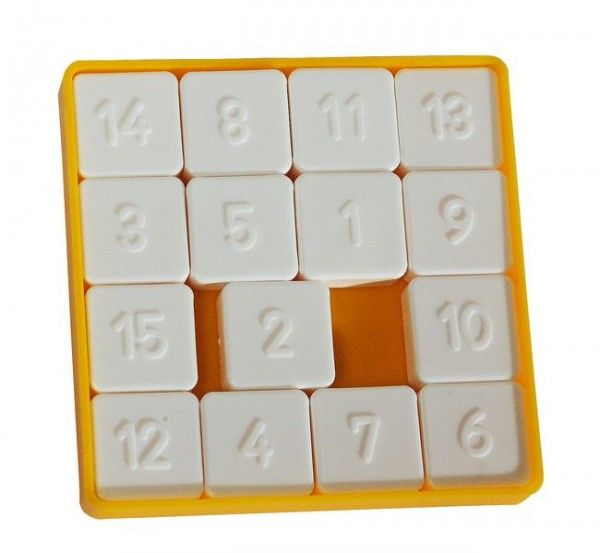

# Hra Přesouvačka - JavaScript
- logika
- třídy, privátní atributy a metody
- listenery, manipulace s DOM, návratové funkce
- šipková funkce () => {} , localStorage
- využití MVC

## Zadání
1. Vytvořte HTML kód odpovídající základní podobě hry Přesouvačka.
   1. Použijte JS pro dynamické vykreslení jednotlivých kamenů na základě vstupu `počet řádků`.
      - Aplikujte MVC (např. dle https://www.taniarascia.com/javascript-mvc-todo-app/). Ukázka implementace události a její zachycení:
         - Controller
            <pre>this.#model.bindGameEnd(this.handleGameEnd);
           handleGameEnd = () => {}</pre>
         - Model
            <pre>onGameEnd = null;
           bindGameEnd(handler){
              this.onGameEnd = handler;
           }</pre>

